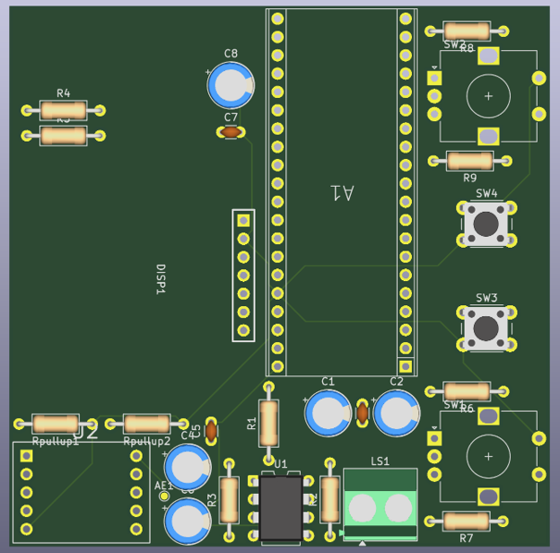
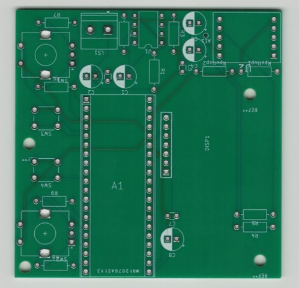

# Embedded Clock Radio

A custom embedded clock radio built around the Raspberry Pi Pico W, featuring
FM radio playback, alarm functionality, an OLED interface, rotary encoder
controls, a custom 4-layer PCB, and a 3D-printed enclosure.

This project was completed for ECE 299 at the University of Victoria.

## Features

- FM radio tuning
- 12/24-hour clock display
- Alarm and snooze functionality
- OLED user interface
- Rotary encoder controls
- Volume control
- RDS station information
- Custom 4-layer PCB
- Integrated audio amplifier
- Custom 3D-printed enclosure

## Hardware

- Raspberry Pi Pico W
- RDA5807M FM receiver
- SSD1306 OLED display
- LM386 audio amplifier
- 2 W, 8 Ω speaker
- Rotary encoders
- Push buttons
- Custom 4-layer PCB

## Communication Interfaces

- I²C — RDA5807M FM receiver
- SPI — SSD1306 OLED display
- GPIO — rotary encoders and push buttons

## PCB Design

The PCB was designed in KiCad as a compact 4-layer board with dedicated
routing for power, ground, digital control, and analog audio signals.

The board was fabricated externally and manually assembled using a combination
of SMD and through-hole components.

## Development and Testing

The system was first prototyped on a breadboard before being transferred to the
custom PCB.

Testing and debugging included:

- Oscilloscope measurements
- Power-supply noise reduction
- Rotary encoder debouncing
- PCB rework after identifying OLED pin-mapping issues
- Audio amplifier troubleshooting
- Full system integration testing

## Enclosure

The enclosure was designed in SolidWorks and 3D printed in PLA.

## My Contributions

This project was completed by a two-person team.

My primary contributions included:

- Leading schematic and PCB design in KiCad
- Designing the 4-layer PCB layout
- Testing FM tuning, audio output, and OLED feedback
- Designing the enclosure in SolidWorks
- Developing UI functionality for time setting and display formatting
- Hardware debugging, testing, and final integration

## Technologies

- KiCad
- SolidWorks
- MicroPython
- Raspberry Pi Pico W
- I²C
- SPI
- Soldering
- Oscilloscope testing
- PCB design
- 3D printing